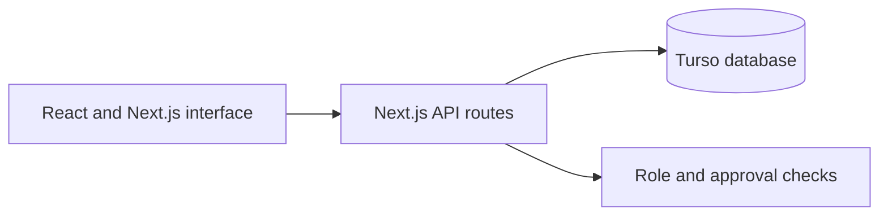

# Campus Plate

**Find food. Find your people.**

Campus Plate is a food event calendar for the Cal Poly community. Students can discover what campus clubs are serving, see when and where events happen, and RSVP. Clubs can publish events after a campus admin approves their account.

## The experience

| Students | Club organizers | Campus admins |
| --- | --- | --- |
| Sign in with a `@calpoly.edu` account, browse the event calendar, and RSVP. | Register a club, then create, edit, and remove food events after approval. | Review new club registrations and approve organizers before they can publish. |

Event listings are available only after sign-in. The public landing page shows a sample calendar so visitors can see how the app works without exposing actual event details.

## Built for Demo Day

- Separate student, club, and admin routes
- Persistent database for accounts, sessions, events, approvals, and RSVPs
- Full create, read, update, and delete flow for club events
- Responsive calendar and event details

## Architecture

The app uses Next.js, React, and a SQLite-compatible Turso database. The demo accepts addresses ending in `@calpoly.edu` but does not confirm email ownership; campus sign-in would be needed before using it with real student data.
